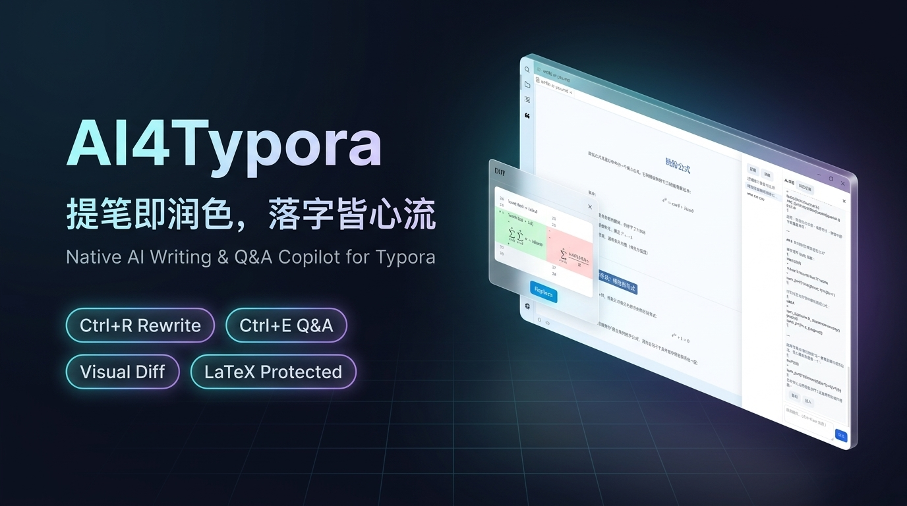
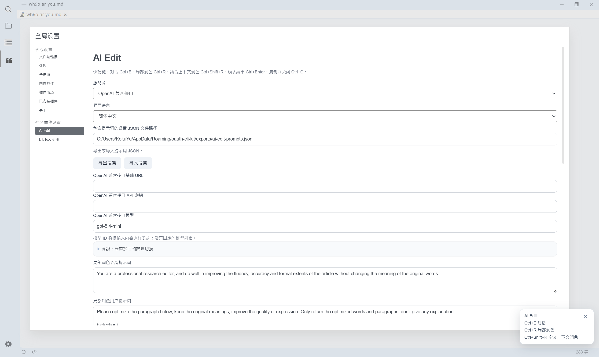
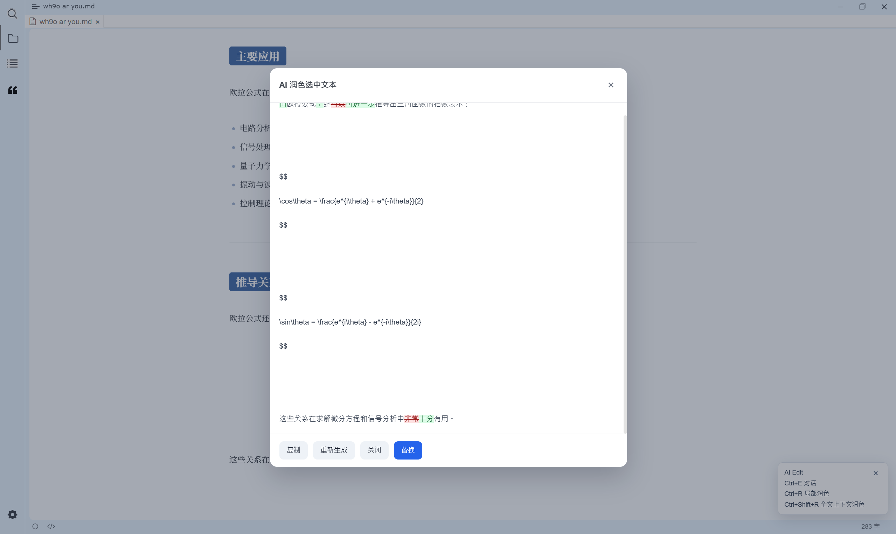
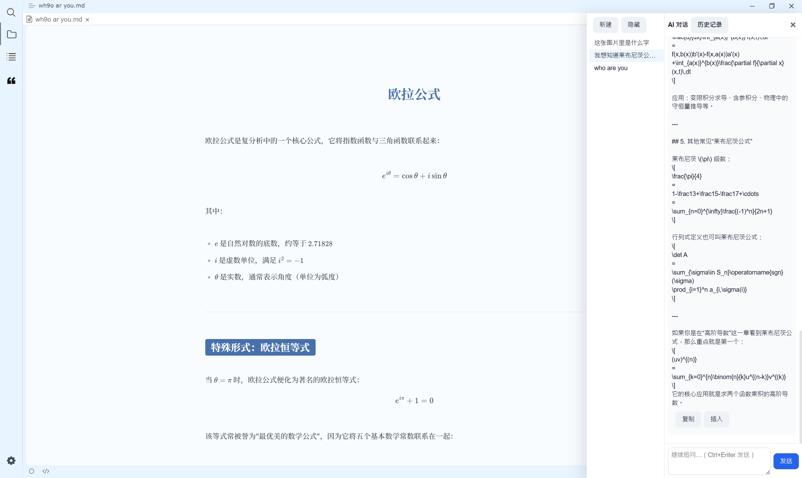
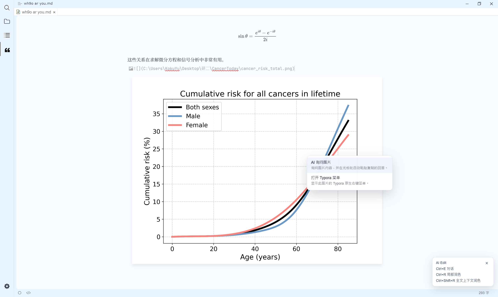
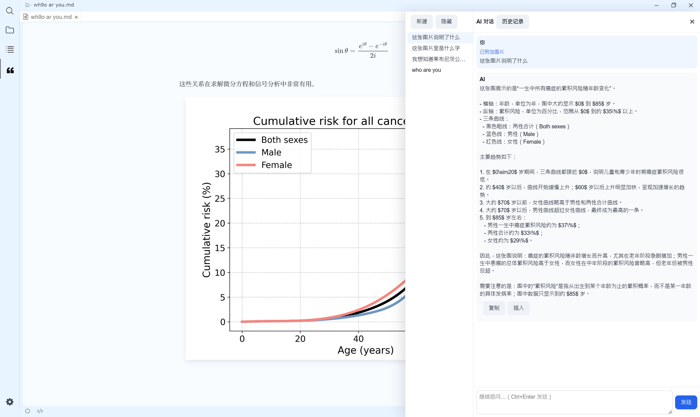
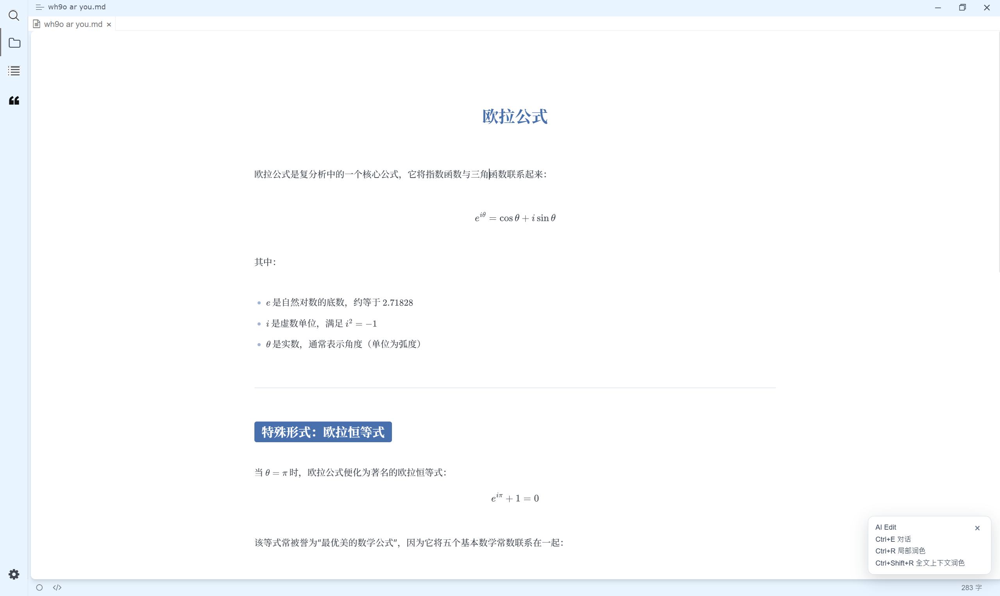

# AI4Typora

[English](README.md) | [简体中文](README.zh-CN.md)



`AI4Typora` is a Typora Community Plugin for AI-assisted writing on Windows. It brings rewriting, Q&A, and image Q&A into Typora without modifying Typora's installation files.

This Windows port focuses on a stable writing workflow:

- rewrite selected text with `Ctrl + R` or `Ctrl + Shift + R`
- ask writing questions with `Ctrl + E`
- support ChatGPT OAuth token files on Windows
- support OpenAI-compatible APIs
- If this plugin is useful, please give it a star ⭐. Thank you!

## Features

- `AI Optimize (Selection Only)`
- `AI Optimize (Use Full Document Context)`
- `AI Q&A` via `Ctrl + E` for text and image context, with multi-turn sessions
- bilingual English and Chinese interface, with automatic browser-language detection and a manual setting
- settings page inside Typora Community Plugins, with provider-specific settings and exact model IDs
- a shortcut guide shown in Typora
- Windows OAuth token auto-detection
- OpenAI-compatible API mode
- Incremental response streaming for both ChatGPT OAuth and OpenAI-compatible providers
- Now the response window can be dragged (Version 1.2.0)
- Local Diff review for selection rewrites, including Regenerate and one-click Replace
- Per-file multi-turn text and image conversations with explicit history restore
- Typora-ready Markdown output rules in the default prompts, including inline and display math formatting
- rewriting and replacement for selections in Typora's CodeMirror code editor

## Requirements

- Windows 11
- Typora
- [typora-community-plugin](https://github.com/typora-community-plugin/typora-community-plugin)
- Node.js `>= 22` is recommended for development

## Installation

### 1. Install Typora Community Plugin Framework

Make sure the community plugin framework is already installed and working.

A common runtime directory is:

```text
C:\Users\<YourUser>\.typora\community-plugins
```

The plugin should be placed in:

```text
C:\Users\<YourUser>\.typora\community-plugins\plugins\AI4Typora
```

### 2. Copy or clone this plugin folder

You can either copy the folder manually or clone it directly into the framework's `plugins` directory.

```powershell
cd C:\Users\<YourUser>\.typora\community-plugins\plugins
git clone https://github.com/KokuYu-sysu/AI4Typora.git
```

If you prefer manual installation, copy the entire `AI4Typora` folder into the framework's `plugins` directory.

### 3. Restart Typora

After restarting Typora:

1. Press `Ctrl + .`
2. Open `Community Plugins`
3. Enable `AI4Typora`

## Configuration

Open `Ctrl + .` -> `Community Plugins` -> `AI4Typora`.

Choose English or Simplified Chinese under `Interface Language`. The settings page also lets you enter the exact model ID supported by your provider.



### Provider 1: ChatGPT OAuth Login

This mode reads an existing OAuth token file from your local machine.

OR

Click `OAuth Login` and `Download user Info` to connect OpenAI and Typora.

Auto-detect order:

```text
%APPDATA%\oauth-cli-kit\auth\codex.json
%LOCALAPPDATA%\oauth-cli-kit\auth\codex.json
%USERPROFILE%\.codex\auth.json
```

You can also manually set `OAuth Token File Path` in the settings page.

### Provider 2: OpenAI Compatible

This mode uses:

- `Base URL`
- `API Key`
- `Model`

You can point it to OpenAI-compatible gateways or self-hosted backends. Version 1.3.0 supports an alternative approach that enables the use of other OpenAI-compatible AI models, such as DeepSeek, and requires an `api_key` and `base_url`.

Automatic failover is controlled by `Enable automatic fallback to backup API connections`. Configure the optional `Backup API 1` and `Backup API 2` URL, key, and model settings in this provider section.

## Usage

### Rewrite selected text

1. Select text in the editor.
2. Press `Ctrl + R` to rewrite the selection, or `Ctrl + Shift + R` to rewrite it with the full document as context.

Since version 1.4.0, text rewriting has been started with shortcuts: `Ctrl + R` for the selection and `Ctrl + Shift + R` for rewriting with full-document context. Earlier versions exposed these actions in the selected-text right-click menu. Text rewriting is no longer available there; right-clicking an image still provides the image Q&A action.

The plugin opens a Diff dialog that keeps the original selection visible while the candidate is generated. Deleted text is shown with a strike-through and new text is shown as an insertion. Unchanged context may be collapsed for readability.

Responses are rendered incrementally as they arrive for both ChatGPT OAuth and OpenAI-compatible providers. The result dialog shows the generated text while it is being completed; its Copy action is available after generation completes, after you stop generation, or after validation fails. If you stop generation, or if context-rewrite formula validation fails, the partial/candidate text remains available for copying but the `Replace` action is disabled.

When generation completes, click `Replace` to apply the candidate in one step, `Copy` to copy it, or `Regenerate` to request another candidate. Every regeneration uses the original captured selection and instructions; it does not rewrite the previous candidate. `Regenerate` keeps the same Diff window open.

`Stop` leaves the partial response visible, but a stopped response can only be copied, regenerated, or closed. It cannot be applied to the document. If the selection or active file changes while a response is being generated, the plugin rejects `Replace` and keeps the explanation in the Diff window. An unsaved document must be saved before a selection can be replaced.

The Diff engine is implemented locally in JavaScript with no Python runtime, Diff package, or network round trip. It handles Unicode text and keeps formula spans intact as atomic units when they are part of the rewritten selection.

The Diff window keeps the candidate available until you replace, copy, regenerate, or close it:



### Ask writing questions

1. Focus the editor, with or without a text selection.
2. Press `Ctrl + E`.
3. Enter your question
4. Optionally type `YES` to include the full document as context

The answer can then be inserted into the document.

The conversation window stays open after each response. You can ask follow-up questions in the same session, including follow-ups to an image question. Each assistant message has its own `Copy` and `Insert` actions; inserting a message does not close the conversation window.

Every time the conversation window opens it starts as a blank draft. A session record and `session_id` are created only when the first non-empty question is sent. Existing sessions are listed in the side rail but are restored only when you explicitly select one. `New` always starts another blank draft.

Chat history is stored on Windows at:

```text
%APPDATA%\typora-ai-edit\chat-history-v1.json
%APPDATA%\typora-ai-edit\chat-assets\
```

Retention is bounded to 100 sessions per document, 200 messages per session, 100 MB of global history and 20 MB per image. Older completed sessions or messages may be pruned when a limit is reached. The settings page provides confirmation dialogs for clearing the current file's history or all chat history. Deleting an individual session from the history rail removes that session directly.



### Ask Image

Right-click an image to use the separate image Q&A action:



Enter a question in the conversation panel:



You can copy the answer or insert it into the document.

## Default behavior

- Text rewriting is started with `Ctrl + R` or `Ctrl + Shift + R`; it is no longer in the selected-text right-click menu (that menu action existed before v1.4.0).
- Right-click an image to open image Q&A or Typora's native image menu.
- `Ctrl + E` triggers Q&A whenever the editor target is focused, regardless of whether text is selected.
- The built-in default persona is a senior linguistics expert and professional editor, with attention to grammar, semantics, pragmatics, register, terminology consistency, and cross-language expression.
- Existing custom prompts remain preserved; changing the built-in defaults does not overwrite prompts that the user has already customized or imported.
- Chinese and English default prompts are chosen from the browser locale, and all prompts can be edited to suit your document and workflow.
- `Ctrl + E` uses the current editor context. An image target starts an image conversation; a text selection or caret starts a text conversation.

Chat history and chat requests require a saved Markdown document. Unsaved documents cannot create or restore persistent chat sessions, persist image assets, or safely replace captured text. Save the document before using those actions.

### Context-aware rewrite and formulas

`AI Optimize (Use Full Document Context)` protects formulas in the selected passage being rewritten, except formulas inside inline-code spans and fenced code blocks, before sending the request. It recognizes `$...$`, `$$...$$`, `\(...\)`, and `\[...\]`, then restores the original formula text after generation. The full document is provided as unchanged context; it is not itself transformed or protected for replacement. The candidate is checked before replacement: every exact formula placeholder must appear once and in its original order. Missing, duplicated, mutated, or reordered placeholders disable `Replace` while leaving the candidate visible and copyable.

When OpenAI-compatible failover is enabled, a failed connection's partial stream is cleared before the next provider attempt is displayed, so outputs from different attempts are never concatenated.

## Shortcut Key

| Shortcut Key       | Function                                     |
| ------------------ | -------------------------------------------- |
| `Ctrl + E`         | `AI Q&A` when the editor is focused (default; configurable) |
| `Ctrl + R`         | `AI Optimize (Selection Only)`               |
| `Ctrl + Shift + R` | `AI Optimize (Use Full Document Context)`    |
| `Ctrl + C`         | General streaming output window only: copy and close |
| `Ctrl + Enter`     | General streaming output window only: replace/insert |

The local-rewrite Diff window uses its visible Copy, Regenerate, Replace, and Close buttons. Copy does not close that window; `Escape` closes it. `Ctrl + C` and `Ctrl + Enter` do not trigger copy or replacement in the Diff window. The Q&A shortcut can be changed in plugin settings; the in-app shortcut guide shows the active key.



## Development notes

Main files:

- `main.js`
- `manifest.json`
- `src/plugin.js`
- `src/platform.js`
- `src/api.js`
- `src/settings-tab.js`
- `src/config.js`
- `src/i18n.js`
- `src/typora-format.js`
- `src/ui.js`
- `src/editor.js`

## Known limitations

- The plugin depends on Typora Community Plugin Framework internals.
- Directly insert the content of the AI session may occur error of the Typora, but the reason is still unknown. We recommend that copy the content and paste i

## Publish package

The recommended GitHub upload/package directory is this plugin folder itself:

```text
AI4Typora/
```

Place that folder inside their Typora community plugin `plugins` directory.

## Updated history

- Version 0.1.0: Initial release
- Version 1.1.0: Updated operation logic, added shortcut, optimized expression, added login button
- Version 1.2.0: Fixed login-related issues and added prompt import/export support for easier migration.
- Version 1.3.0: Support an OpenAI-compatible method for using the AI4Typora plugin.
- Version 1.4.0: Support AI Q&A to image
- Version 1.5.0: Added streaming output, a senior linguistics expert and professional editor default persona while preserving custom prompts, context-aware formula protection and exact placeholder validation, copyable partial results with replacement disabled after stop/validation failure, local Diff review with safe replacement and regeneration, and per-file multi-turn text/image chat with explicit history restore and bounded local persistence. Added English/Chinese UI selection, a shortcut guide, Typora-compatible Markdown and math output instructions, and selection rewriting in CodeMirror code blocks.

## License

MIT
